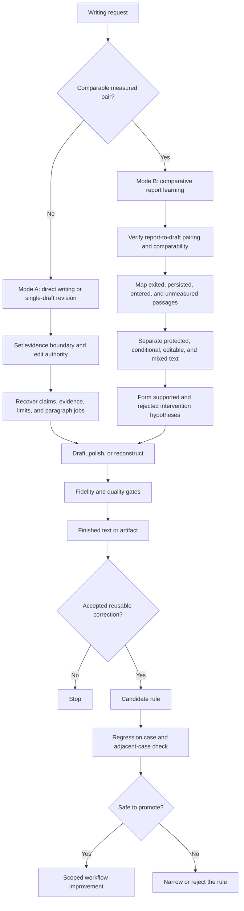

# Writing Studio

**Evidence-bound writing and revision for Codex — with a strong first-pass workflow and an optional before/after report-learning mode.**

Writing Studio is a reusable Codex skill for drafting, rewriting, polishing, translating, humanizing, and critiquing substantial Chinese or English prose. It is designed around one principle: better writing should come from clearer thought, stronger evidence relationships, and a recognisable authorial position—not from detector tricks or mechanical synonym replacement.

> One draft is enough. Historical versions and AI-writing reports are optional evidence, never prerequisites for a strong first result.

[中文介绍](#中文介绍) · [Quick start](#quick-start) · [How it works](#how-it-works) · [Safety and integrity](#safety-and-integrity)

## Why this skill exists

General-purpose writing prompts often produce one of two weak outcomes:

- a shallow sentence-level polish that leaves the original template structure intact; or
- an aggressive rewrite that quietly changes evidence, claim strength, quotations, or the author's intended meaning.

Writing Studio separates **execution mode** from **edit authority**. It first decides what evidence is available, then decides how deeply it may intervene. This gives a single draft the strongest justified first pass while allowing measured before/after revisions to become structured learning evidence.

## Two execution modes

| Mode | Use it when | What it does |
|---|---|---|
| **Mode A — Direct writing / single-draft** | You have notes, source material, or one current draft | Drafts or revises immediately from the available evidence. It does not wait for an older version, writing sample, or detector report. |
| **Mode B — Comparative report learning** | You have before and after drafts with their respective AI-writing reports | Maps exited, persisted, entered, and unmeasured passages; separates real editorial change from layout or measurement effects; then transfers only supported lessons into the next revision. |

Mode B supports three actions:

- **learn-and-revise** — diagnose the measured pair, then revise the current draft;
- **learn-only** — freeze the document and update the reusable editorial lessons;
- **diagnose-only** — explain the comparison without silently rewriting.

If the comparison set is incomplete, Writing Studio degrades gracefully. For example, two reports without their corresponding drafts support only report-level observations, not reliable edit attribution.

## Edit authority

Both modes respect the user's requested change boundary:

| Depth | Boundary |
|---|---|
| **Expression-only** | Preserve argument, evidence coverage, conclusion, protected text, and approximate length; improve wording and local flow. |
| **Light** | Repair grammar, punctuation, awkward phrasing, and local clarity. |
| **Substantive** | Reorder or rebuild weak paragraphs and sections while preserving thesis, evidence, citation intent, and claim strength. |
| **Full reconstruction** | Recover the source ledger and rebuild prompt-shaped prose from its evidence rather than paraphrasing inherited sentences. |

## Quick start

### Install

Clone this repository into your personal Codex skills directory:

```powershell
git clone https://github.com/dengjihui1/writing-studio.git "$env:USERPROFILE\.codex\skills\writing-studio"
```

Or ask Codex to install the skill from this GitHub repository using its skill installer.

### Mode A: ordinary writing or polishing

```text
$writing-studio Polish this article. Keep the content and approximate length,
but improve its expression, logic, and natural authorial voice.
```

中文短指令：

```text
$writing-studio 润色这篇文章，内容和篇幅基本不变，重点改善语言、逻辑和自然作者感。
```

### Mode B: learn from two measured versions

Supply:

1. the before draft;
2. its AI-writing report;
3. the after draft;
4. its AI-writing report;
5. the current version to revise, if different from the after draft.

Then invoke:

```text
$writing-studio Compare the before and after drafts with their respective reports.
Identify supported and rejected revision hypotheses, then revise the current version
while preserving facts, quotations, citations, conclusions, and the content budget.
```

中文短指令：

```text
$writing-studio 使用双报告对比模式：对比修改前后文稿和两次 AI 报告，
先总结有效与无效改法，再据此润色当前版本；保护事实、引语、引用、结论和篇幅。
```

## How it works



The learning loop is deliberately conservative:

`observed result → accepted correction → candidate rule → regression case → adjacent-case check → promote, narrow, or reject`

A single successful rewrite may create a candidate lesson. It does not automatically become a universal rule.

## What “humanize” means here

Writing Studio uses *humanization* as editorial quality control. It looks for:

- concrete actors, decisions, conditions, evidence relations, and consequences;
- paragraphs that develop one question rather than list complete mini-answers;
- sections whose order matters and whose paragraphs cannot be swapped freely;
- citations that perform different jobs—evidence, definition, contrast, limit, or context;
- selective emphasis, calibrated claims, and natural target-language rhythm;
- template residue, repeated balanced endings, empty abstraction, and chatbot commentary.

It does **not** add deliberate errors, fake anecdotes, invisible characters, random fragments, translation loops, or synonym-spun prose. It does not promise a detector score.

## Safety and integrity

The workflow protects:

- names, dates, numbers, chronology, equations, and technical terms;
- verbatim interview, survey, and source quotations;
- citations and their intended evidentiary scope;
- causal direction, uncertainty, limitations, and claim strength;
- the user's required content and approximate development.

AI-writing reports and similarity reports remain separate. Similarity is reviewed for quotation, citation, and source-use integrity; zero similarity is not treated as a quality target.

## Report mapping helper

`scripts/turnitin_passage_map.py` can map coloured passages in compatible Turnitin-style PDF reports back to Markdown or DOCX paragraphs and create a reproducible comparison table.

```text
python scripts/turnitin_passage_map.py \
  --case before 54 before-report.pdf before-draft.docx \
  --case after 37 after-report.pdf after-draft.docx \
  --output passage-map.md
```

The helper extracts editorial evidence. It does not predict or optimise a detector score. Representative mappings should be visually checked because report layouts can change.

## Repository structure

```text
writing-studio/
├── SKILL.md                         # entrypoint, routing, shared constraints
├── agents/openai.yaml               # Codex UI metadata and invocation policy
├── references/
│   ├── intake-and-routing.md        # mode and edit-depth selection
│   ├── drafting.md                  # drafting workflow
│   ├── editing.md                   # editing, translation, and critique
│   ├── first-pass-reconstruction.md # deep single-draft reconstruction
│   ├── human-writing.md             # authored-prose diagnostics
│   ├── detector-feedback.md         # Mode B comparison workflow
│   ├── feedback-learning-loop.md    # correction-to-regression evolution
│   ├── genre-playbooks.md           # genre-specific routing
│   ├── quality-gates.md             # fidelity and delivery checks
│   └── evaluation.md                # 51 behavioural evaluation cases
└── scripts/
    └── turnitin_passage_map.py      # optional report-to-passage mapper
```

## Evaluation philosophy

The evaluation suite checks decisions and observable behaviour rather than exact wording. A release candidate should have no score below 4/5 and no integrity failure across task fit, source fidelity, structural coherence, voice preservation, natural specificity, report discipline, mode routing, learning-scope discipline, and delivery usefulness.

Fabricated facts, quotations, citations, credentials, or experiences are automatic failures. So are detector guarantees and deliberate error insertion.

## 中文介绍

Writing Studio 是一个面向 Codex 的中英文写作技能包，支持从零写作、普通润色、深度重构、翻译、批评分析，以及基于前后两个版本和两次检测报告的对比学习。

它的核心区别是把两个问题分开处理：

1. **当前有哪些证据可用？** 只有一篇稿件时直接进入普通模式；存在完整的前后稿和对应报告时，才进入对比学习模式。
2. **用户允许改到什么程度？** 表述润色不会擅自变成内容重写；深度重构也必须保留事实、证据边界、引用意图和结论强度。

这个技能追求的是高质量、逻辑清楚、具有真实作者判断的文字。检测报告只作为有噪声的诊断证据，不被当作作者身份判决，也不会通过错别字、隐形字符、随机句长等方式规避检测。

当一次真实修改被用户接受，技能不会立刻把它写成万能规则，而是先形成候选经验，再建立回归案例和相邻场景检查。只有经过验证、没有破坏事实与文章质量的经验，才会进入默认工作流。

## Contributing

Contributions are welcome when they improve a decision, preserve source fidelity, and include a realistic regression case. Read [CONTRIBUTING.md](CONTRIBUTING.md) before proposing workflow rules.

## License

Released under the [MIT License](LICENSE).

